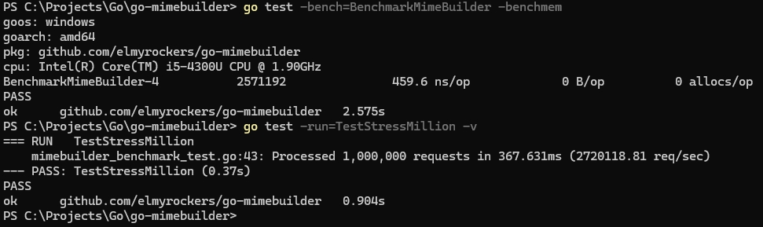

# go-mimebuilder

<div align="center">
    
</div><br>

**A High-Performance, Zero-Allocation Go library for generating raw MIME messages.** Designed for high-concurrency systems and low-memory environments, it produces standards-compliant output ready for any SMTP client, mail server, or cloud API.

## Why go-mimebuilder?
- **Zero-Allocation Architecture:** Uses `bytebufferpool` to recycle memory, drastically reducing GC overhead on low-RAM (1GB) VPS instances.
- **High-Speed String Handling:** Implements `unsafe` pointer arithmetic for zero-copy string-to-byte conversions, ensuring lightning-fast header construction.
- **Preallocated Buffers:** Slices are pre-sized to `4KB` (OS page size) to eliminate memory fragmentation and "realloc" lag.
- **Smart MIME Nesting:** Automatically manages complex `mixed`, `alternative`, and `related` structures based on your content.
- **RFC 5322 Compliant:** Strictly enforces `\r\n` (CRLF) endings and proper headers to ensure 100% deliverability.
- **Fluent API:** Clean, chainable method syntax for building complex emails in a single, readable block.
- **Inline Image Support (CID):** Full support for embedding images directly into HTML bodies using unique Content-IDs.
- **Dual-Mode Attachments:** Flexible support for attaching raw `[]byte` or streaming via `io.Reader` for large file handling.

## Quickstart

Install the library:
```bash
go get github.com/elmyrockers/go-mimebuilder
```

Basic Example:
```go
package main

import (
    "fmt"
    "os"

    "github.com/elmyrockers/go-mimebuilder"
)

func main() {
    // 1. Initialize builder
        builder := mimebuilder.New()

    // 2. Chain email data and build
    // Returns a pooled buffer for 0 B/op performance
        mime, err := builder.SetFrom("Your Name", "yourname@example.com").
            AddTo("Helmi Aziz", "helmi@xeno.com.my").
            SetSubject("High Performance MIME").
            SetBody("<h1>Hello!</h1><p>Sent via go-mimebuilder.</p>").AsHTML().
            SetAltBody("Hello! Sent via go-mimebuilder.").
            Attach("document.pdf", []byte("%PDF-1.4...")).
            Build()

        if err != nil {
            panic(err)
        }

    // 3. Essential: Return the buffer to the pool when finished
        defer builder.Release(mime)

    // 4. Access the raw bytes
        raw := mime.Bytes()

    // 5. Use the data (e.g., save to .eml or send via SMTP)
        fmt.Printf("Generated %d bytes of MIME data\n", len(raw))
        os.WriteFile("message.eml", raw, 0644)
}
```

## Performance Results

| Scenario                | ns/op   | B/op | allocs/op | Total Requests | Duration   | Throughput (req/sec) |
|-------------------------|---------|------|-----------|----------------|------------|----------------------|
| BenchmarkMimeBuilder    | 459.6   | 0    | 0         | auto‑scaled    | ~2.57s     | —                    |
| Stress Test (1M runs)   | —       | 0    | 0         | 1,000,000      | 367.6 ms   | 2,720,118            |

**Environment:** Go 1.22, Windows 11, Intel i5‑4300U @ 1.90GHz  

### **Key takeaway:**  
- The micro‑benchmark confirms **zero allocations per operation** with ~460 ns/op steady‑state performance.  
- The stress test shows the library can process **1 million requests in under 0.4 seconds**, sustaining ~2.7 million requests per second with zero allocations.

