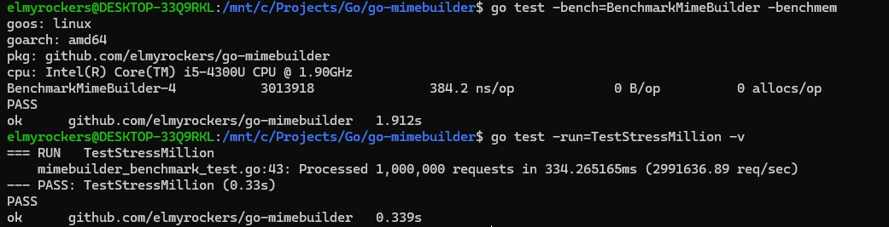

# go-mimebuilder
[](https://pkg.go.dev/github.com/elmyrockers/go-mimebuilder)
[](https://golang.org)
[](LICENSE)
[](https://github.com/elmyrockers/go-mimebuilder/actions/workflows/unit-tests.yml)


<div align="center">
    
</div><br>

**A High-Performance, Zero-Allocation Go library for generating raw MIME messages.** Designed for high-concurrency systems and low-memory environments, it produces standards-compliant output ready for any SMTP client, mail server, or cloud API.

## Why go-mimebuilder?
- **Zero-Allocation Architecture:** Uses `bytebufferpool` to recycle memory, drastically reducing GC overhead on low-RAM (1GB) VPS instances.
- **High-Speed String Handling:** Implements `unsafe` pointer arithmetic for zero-copy string-to-byte conversions, ensuring lightning-fast header construction.
- **Preallocated Buffers:** Body content buffers are pre-sized to `4KB` (OS page size) to reduce reallocation overhead for typical email bodies.
- **Smart MIME Nesting:** Automatically manages complex `mixed`, `alternative`, and `related` structures based on your content.
- **Header Injection Protection:** All headers use sanitized CRLF-safe construction to prevent injection attacks.
- **Fluent API:** Clean, chainable method syntax for building complex emails in a single, readable block.
- **Inline Image Support (CID):** Full support for embedding images directly into HTML bodies using unique Content-IDs.
- **Dual-Mode Attachments:** Flexible support for attaching raw `[]byte` or streaming via `io.Reader` for large file handling.

## Quickstart

Install the library:
```bash
go get github.com/elmyrockers/go-mimebuilder@latest
```

Basic Example:
```go
package main

import (
    "fmt"
    "os"

    "github.com/elmyrockers/go-mimebuilder"
)

func main() {
    // 1. Initialize builder
        builder := mimebuilder.New()

    // 2. Chain email data and build
    // Returns a pooled buffer for 0 B/op performance
        mime, err := builder.SetFrom("Your Name", "yourname@example.com").
            AddTo("Helmi Aziz", "helmi@xeno.com.my").
            SetSubject("High Performance MIME").
            SetBody("<h1>Hello!</h1><p>Sent via go-mimebuilder.</p>").AsHTML().
            SetAltBody("Hello! Sent via go-mimebuilder.").
            Attach("document.pdf", []byte("%PDF-1.4...")).
            Build()

        if err != nil {
            panic(err)
        }

    // 3. Essential: Return the buffer to the pool when finished
        defer builder.Release(mime)

    // 4. Access the raw bytes
        raw := mime.Bytes()

    // 5. Use the data (e.g., save to .eml or send via SMTP)
        fmt.Printf("Generated %d bytes of MIME data\n", len(raw))
        os.WriteFile("message.eml", raw, 0644)
}
```

## API Reference

| Method | Description |
|---|---|
| `New() *MimeBuilder` | Creates a new `MimeBuilder` with preallocated buffers. |
| `SetFrom(email, name string) *MimeBuilder` | Sets the `From` header. `name` is optional. |
| `AddTo(email, name string) *MimeBuilder` | Adds a recipient to `To`. Can be called multiple times. |
| `AddCC(email, name string) *MimeBuilder` | Adds a recipient to `Cc`. Can be called multiple times. |
| `AddBCC(email, name string) *MimeBuilder` | Adds a recipient to `Bcc`. Can be called multiple times. |
| `AddReplyTo(email, name string) *MimeBuilder` | Adds an address to `Reply-To`. Can be called multiple times. |
| `SetSubject(subject string) *MimeBuilder` | Sets the subject line (auto Q-encoded at build time). |
| `SetBody(content string) *MimeBuilder` | Sets the primary body content (plain text by default). |
| `AsHTML() *MimeBuilder` | Marks the body set via `SetBody` as HTML. |
| `SetAltBody(content string) *MimeBuilder` | Sets a plain-text fallback body for HTML messages. |
| `Embed(filename string, data []byte, cid string) *MimeBuilder` | Embeds an inline image referenced by Content-ID. |
| `Attach(filename string, data []byte) *MimeBuilder` | Attaches a file from an in-memory byte slice. |
| `AttachReader(filename string, r io.Reader) *MimeBuilder` | Attaches a file from an `io.Reader` stream. |
| `AttachStream(filename string, r io.Reader) *MimeBuilder` | Alias of `AttachReader`. |
| `AttachFile(filename string, path string) *MimeBuilder` | Reads a file from disk and attaches it under `filename`. Read errors are recorded internally, not returned. |
| `Build() (*bytebufferpool.ByteBuffer, error)` | Builds the final MIME message into a pooled buffer. |
| `Release(buf *bytebufferpool.ByteBuffer)` | Returns the buffer to the pool and resets builder state for reuse. |
| `WriteTo(w io.Writer)` | Will be added soon. |


## Hot Path vs Cold Path

**Hot path** — called on every message build, optimized for minimal allocation (reused buffers, `str2bytes`, pooled buffers). Safe to call at high throughput.

**Cold path** — either allocates freely, touches disk/IO, or is expected to run rarely (setup, error handling, one-off attachments). Not optimized for high-frequency use.

| Method | Path | Why |
|---|---|---|
| `New()` | Cold | Called once per builder instance. |
| `SetFrom(email, name string) *MimeBuilder` | Hot | Reuses preallocated buffer, zero-copy via `str2bytes` when input is clean. |
| `AddTo(email, name string) *MimeBuilder` | Hot | Same as above; appends to preallocated buffer. |
| `AddCC(email, name string) *MimeBuilder` | Hot | Same as above. |
| `AddBCC(email, name string) *MimeBuilder` | Hot | Same as above. |
| `AddReplyTo(email, name string) *MimeBuilder` | Hot | Same as above. |
| `SetSubject(subject string) *MimeBuilder` | Hot | Reuses preallocated buffer; Q-encoding happens later in `Build()`. |
| `SetBody(content string) *MimeBuilder` | Hot | Reuses preallocated 4KB buffer. |
| `AsHTML() *MimeBuilder` | Hot | Just flips a bool. |
| `SetAltBody(content string) *MimeBuilder` | Hot | Reuses preallocated 4KB buffer. |
| `Embed(filename string, data []byte, cid string) *MimeBuilder` | Cold | Allocates new slices per call (`make([]byte, ...)` for filename/CID); typically called only a few times per message. |
| `Attach(filename string, data []byte) *MimeBuilder` | Cold | Allocates a new filename slice per call; attachments are inherently occasional. |
| `AttachReader(filename string, r io.Reader) *MimeBuilder` | Cold | Same allocation profile as `Attach`; also defers I/O to `Build()`. |
| `AttachStream(filename string, r io.Reader) *MimeBuilder` | Cold | Alias of `AttachReader`. |
| `AttachFile(filename string, path string) *MimeBuilder` | Cold | Performs disk I/O (`os.ReadFile`) plus allocation via `Attach`; the most expensive call in the API. |
| `Build() (*bytebufferpool.ByteBuffer, error)` | Hot | Uses `bytebufferpool` and in-place buffer growth (e.g. `encodeBase64`'s capacity guard); designed to be called once per message but optimized to minimize allocation even with attachments. |
| `Release(buf *bytebufferpool.ByteBuffer)` | Hot | Returns buffer to pool, resets internal slices via `[:0]` (no reallocation). |
| `WriteTo(w io.Writer) error` | — | Unimplemented; no-op. |

## Performance Results

| Scenario                | ns/op   | B/op | allocs/op | Total Requests | Duration   | Throughput (req/sec) |
|-------------------------|---------|------|-----------|----------------|------------|----------------------|
| BenchmarkMimeBuilder    | 384.2   | 0    | 0         | auto‑scaled    | ~1.91s     | —                    |
| Stress Test (1M runs)   | —       | 0    | 0         | 1,000,000      | 334.2 ms   | 2,991,636            |

**Environment:** Go 1.26.1, Linux Ubuntu 24.04.3 LTS, Intel i5‑4300U @ 1.90GHz  

### **Key takeaway:**  
>- The micro‑benchmark confirms **zero allocations per operation** with ~384 ns/op steady‑state performance.  
>- The stress test shows the library can process **1 million requests in ~0.33 seconds**, sustaining ~2.99 million requests per second with zero allocations.

